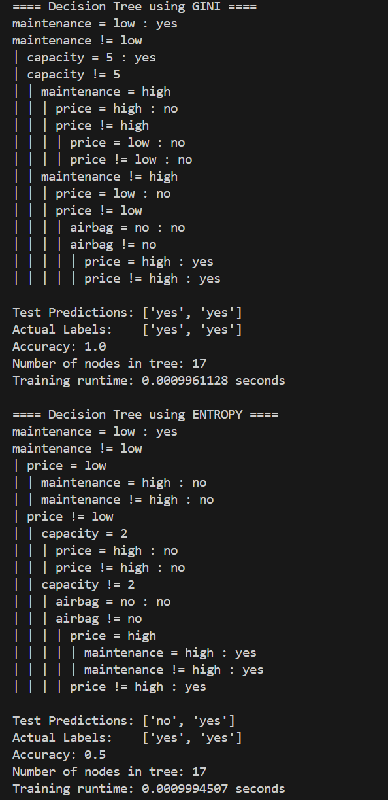

# Decision Tree Analysis Report# Decision Tree Analysis Report

## 1. Overview

This project implements a **Decision Tree algorithm from scratch** to predict whether a car is profitable. Two splitting criteria were used:

- **GINI Impurity**  
- **Entropy (Information Gain)**

The dataset contains categorical attributes: `price`, `maintenance`, `capacity`, and `airbag`.

---

## 2. Equations

### Gini Impurity
The Gini impurity measures how often a randomly chosen element would be incorrectly classified if it were randomly labeled according to the distribution of labels in a dataset.

    Gini(D) = 1 - Σ(p_i²)

Where:  
- \(C\) = number of classes  
- \(p_i\) = probability of class \(i\) in dataset \(D\)

### Entropy
Entropy measures the uncertainty or disorder in the dataset.

    Entropy(D) = - Σ( p_i * log2(p_i) )

### Information Gain
Information Gain measures the reduction in entropy after a dataset is split on an attribute.

    IG(D, A) = Entropy(D) − Σ( |D_v| / |D| * Entropy(D_v) )
    
Where:  
- \(A\) = attribute (feature)  
- \(D_v\) = subset where attribute \(A\) takes value \(v\)  
---

## 3. Results

**Observation GINI:**  
The GINI-based tree perfectly predicted the test data with 100% accuracy. The tree splits on `maintenance` first, followed by `capacity` and other attributes.

---

**Observation Information Gain (Entropy):**  
The ENTROPY-based tree was less accurate on the test data (50%). It also splits first on `maintenance`, but then chooses `price` and `capacity` differently, which leads to one wrong prediction.

---

## 4. Comparison and Analysis

- **Accuracy:** GINI performed better than ENTROPY on this small test set.  
- **Tree Size:** Both trees have the same number of nodes (17), showing that the structure can differ even if the node count is identical.  
- **Training Time:** Both methods are extremely fast (<0.001 seconds).  
- **Insights:** For this dataset, GINI is slightly better in choosing splits that generalize correctly to the test set. ENTROPY may be more sensitive to smaller differences in distributions.

---

## 5. Conclusion

- The Decision Tree algorithm successfully predicts car profitability using categorical attributes.  
- GINI impurity gave perfect predictions on this test set, while ENTROPY had some misclassification.  
- Both methods are valid, but GINI might be slightly more robust for small datasets with discrete categorical features.  

